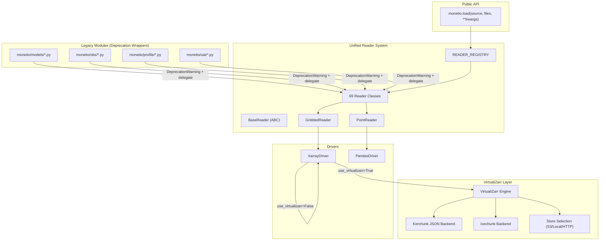
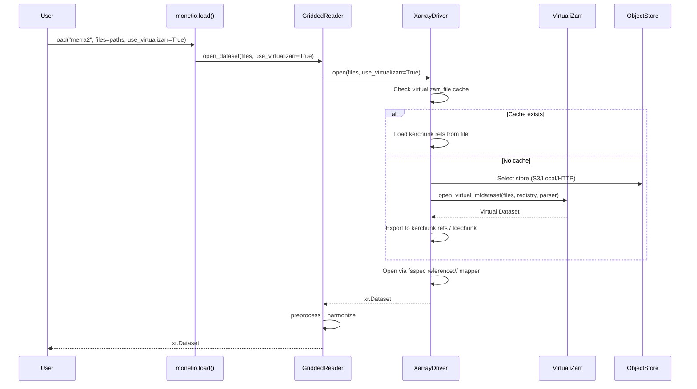

# Design Document: VirtualiZarr Reader Refactor

## Overview

This design describes the architectural changes needed to:

1. **Extend VirtualiZarr support** uniformly across all GriddedReader subclasses via the XarrayDriver, adding Icechunk as an alternative backend to kerchunk JSON references.
2. **Convert all legacy modules** (monetio/obs/, monetio/models/, monetio/profile/, monetio/sat/) into thin deprecation wrappers that delegate to the unified reader system in monetio/readers/.
3. **Standardize reader structure** so all 69 readers follow a uniform pattern (single registered class, consistent signatures, module-level helpers).

The refactor preserves full backward compatibility — existing `monetio.load()` calls and legacy module imports continue to work — while establishing a clear migration path via DeprecationWarnings.

### Key Design Decisions

- **VirtualiZarr stays in XarrayDriver**: Rather than adding VirtualiZarr logic to each reader, the driver handles it transparently. Readers opt in via `use_virtualizarr=True` kwargs that flow through `open_dataset()` → `self.driver.open()`.
- **Icechunk as optional backend**: The `virtualizarr_backend` parameter selects between "kerchunk" (default, JSON file) and "icechunk" (versioned repository). Both are optional dependencies.
- **Deprecation wrappers use a shared helper**: A single `_emit_deprecation()` utility in monetio/readers/_deprecation.py ensures consistent warning format and behavior across all legacy modules.
- **PointReaders silently ignore VirtualiZarr kwargs**: Since VirtualiZarr only applies to gridded data, PointReader.open_dataset() accepts and discards these kwargs to avoid errors when users pass them through `monetio.load()`.

## Architecture



### Data Flow: VirtualiZarr Path



## Components and Interfaces

### 1. XarrayDriver (Enhanced)

**File**: `monetio/readers/drivers.py`

The existing XarrayDriver.open() method gains two new parameters:

```python
class XarrayDriver:
    def open(
        self,
        files: str | list[str],
        use_dask: bool = False,
        use_cubed: bool = False,
        use_virtualizarr: bool = False,
        virtualizarr_file: str | None = None,
        virtualizarr_backend: str = "kerchunk",  # NEW: "kerchunk" | "icechunk"
        icechunk_repo: str | None = None,         # NEW: path to Icechunk repo
        **kwargs,
    ) -> xr.Dataset:
        ...
```

**Store selection logic** (already partially implemented):

```python
def _select_store(file_list: list[str], storage_options: dict) -> tuple[Registry, list[str]]:
    """Select the appropriate object store based on file protocol."""
    registry = ObjectStoreRegistry()

    if file_list[0].startswith("s3://"):
        bucket = file_list[0].replace("s3://", "").split("/")[0]
        config = _build_s3_config(storage_options)
        store = S3Store(bucket, config=config)
        registry.register(f"s3://{bucket}", store)
    elif file_list[0].startswith("http://") or file_list[0].startswith("https://"):
        store = HTTPStore()
        registry.register("http://", store)
        registry.register("https://", store)
    else:
        store = LocalStore(prefix="/")
        registry.register("file:///", store)
        file_list = [f"file://{f}" if not f.startswith("file://") else f for f in file_list]

    return registry, file_list
```

**Icechunk backend** (new code path):

```python
def _open_via_icechunk(vds, icechunk_repo: str, virtualizarr_file: str | None) -> xr.Dataset:
    """Store/load virtual references via Icechunk."""
    import icechunk

    repo = icechunk.Repository.open_or_create(icechunk_repo)
    session = repo.writable_session("main")
    store = session.store

    vds.virtualize.to_icechunk(store)
    session.commit("VirtualiZarr references")

    # Re-open for reading
    session = repo.readonly_session()
    return xr.open_zarr(session.store, consolidated=False)
```

### 2. Deprecation Helper

**File**: `monetio/readers/_deprecation.py` (new)

```python
import warnings
from functools import wraps


def deprecated_wrapper(legacy_name: str, load_equivalent: str, removal_version: str = "0.4.0"):
    """
    Decorator that emits a DeprecationWarning when a legacy function is called.

    Parameters
    ----------
    legacy_name : str
        Full qualified name of the deprecated function (e.g., "monetio.models.cmaq.open_dataset").
    load_equivalent : str
        The recommended monetio.load() call (e.g., 'monetio.load("cmaq", files=...)').
    removal_version : str
        Version when the function will be removed.
    """
    def decorator(func):
        @wraps(func)
        def wrapper(*args, **kwargs):
            warnings.warn(
                f"{legacy_name} is deprecated and will be removed in v{removal_version}. "
                f"Use {load_equivalent} instead.",
                DeprecationWarning,
                stacklevel=2,
            )
            return func(*args, **kwargs)
        return wrapper
    return decorator
```

### 3. GriddedReader Base Class (Enhanced)

**File**: `monetio/readers/base.py`

```python
class GriddedReader(BaseReader):
    def __init__(self):
        self.driver = XarrayDriver()

    def open_dataset(
        self,
        files: str | list[str],
        use_virtualizarr: bool = False,
        virtualizarr_file: str | None = None,
        virtualizarr_backend: str = "kerchunk",
        icechunk_repo: str | None = None,
        use_dask: bool = False,
        **kwargs,
    ) -> xr.Dataset:
        """
        Uses XarrayDriver to open files. VirtualiZarr options are forwarded to the driver.
        """
        ds = self.driver.open(
            files,
            use_virtualizarr=use_virtualizarr,
            virtualizarr_file=virtualizarr_file,
            virtualizarr_backend=virtualizarr_backend,
            icechunk_repo=icechunk_repo,
            use_dask=use_dask,
            **kwargs,
        )
        return self.harmonize(ds)
```

### 4. PointReader Base Class (Enhanced)

**File**: `monetio/readers/base.py`

```python
class PointReader(BaseReader):
    def open_dataset(
        self,
        files: str | list[str],
        # VirtualiZarr kwargs accepted but ignored for PointReaders
        use_virtualizarr: bool = False,
        virtualizarr_file: str | None = None,
        virtualizarr_backend: str = "kerchunk",
        icechunk_repo: str | None = None,
        # Standard PointReader kwargs
        read_method: str = "read_csv",
        as_xarray: bool = True,
        lazy: bool = False,
        **kwargs,
    ) -> Union[pd.DataFrame, xr.Dataset]:
        # Silently ignore VirtualiZarr kwargs (not applicable to point data)
        df = self.driver.open(files, read_method=read_method, lazy=lazy, **kwargs)
        df = self.harmonize(df)
        if as_xarray:
            return self.to_xarray(df, **kwargs)
        return df
```

### 5. Legacy Wrapper Pattern

**Example**: `monetio/models/cmaq.py` (after refactor)

```python
"""CMAQ File Reader. Deprecated wrapper — use monetio.load('cmaq', ...) instead."""

from ..readers._deprecation import deprecated_wrapper
from ..readers.cmaq import CMAQReader  # noqa: F401


@deprecated_wrapper(
    "monetio.models.cmaq.open_dataset",
    'monetio.load("cmaq", files=...)',
)
def open_dataset(fname, **kwargs):
    return CMAQReader().open_dataset(files=fname, **kwargs)


@deprecated_wrapper(
    "monetio.models.cmaq.open_mfdataset",
    'monetio.load("cmaq", files=...)',
)
def open_mfdataset(fname, **kwargs):
    return CMAQReader().open_dataset(files=fname, **kwargs)
```

### 6. pyproject.toml Optional Dependencies

```toml
[project.optional-dependencies]
virtualizarr = [
    "virtualizarr>=1.0",
    "obstore",
    "obspec_utils",
    "ujson",
    "zarr>=2.18",
]
icechunk = [
    "icechunk>=0.1",
    "monetio[virtualizarr]",
]
```

## Data Models

### VirtualiZarr Configuration

The VirtualiZarr subsystem uses the following configuration flow:

| Parameter | Type | Default | Description |
|-----------|------|---------|-------------|
| `use_virtualizarr` | bool | False | Enable VirtualiZarr path |
| `virtualizarr_file` | str \| None | None | Path to cache kerchunk JSON refs |
| `virtualizarr_backend` | str | "kerchunk" | Backend: "kerchunk" or "icechunk" |
| `icechunk_repo` | str \| None | None | Path to Icechunk repository |
| `storage_options` | dict | {} | Passed to object store (anon, region, etc.) |

### Kerchunk Reference Format

The kerchunk JSON file stores byte-range references:

```json
{
  "version": 1,
  "refs": {
    ".zmetadata": "...",
    "time/0": ["s3://bucket/file1.nc", 1024, 256],
    "temperature/0.0": ["s3://bucket/file1.nc", 2048, 4096]
  }
}
```

### Reader Registry State

After refactor, `READER_REGISTRY` contains all 69 reader names mapped to their classes. The `_READER_MODULES` dict in `monetio/__init__.py` provides lazy import paths for each.

### Deprecation Warning Message Format

```
{legacy_function_name} is deprecated and will be removed in v{removal_version}. Use {load_equivalent} instead.
```

Example:
```
monetio.models.cmaq.open_dataset is deprecated and will be removed in v0.4.0. Use monetio.load("cmaq", files=...) instead.
```

## Correctness Properties

*A property is a characteristic or behavior that should hold true across all valid executions of a system — essentially, a formal statement about what the system should do. Properties serve as the bridge between human-readable specifications and machine-verifiable correctness guarantees.*

### Property 1: Store Selection by Protocol

*For any* file path with a recognized protocol prefix (s3://, http://, https://, or local path), the XarrayDriver VirtualiZarr path SHALL select the correct object store type (S3Store for s3://, HTTPStore for http/https, LocalStore for local) and, for local files, prefix them with file://.

**Validates: Requirements 1.5, 1.6, 1.7**

### Property 2: VirtualiZarr Kwargs Forwarding Through Load

*For any* registered reader name and any combination of VirtualiZarr-related kwargs (use_virtualizarr, virtualizarr_file, virtualizarr_backend, icechunk_repo), calling `monetio.load(source, files, **vz_kwargs)` SHALL forward those kwargs to the reader's `open_dataset()` method for GriddedReaders, and SHALL silently ignore them for PointReaders without raising an error.

**Validates: Requirements 3.1, 3.2, 3.3**

### Property 3: Legacy Wrapper Delegation

*For any* legacy wrapper function in monetio/models/, monetio/obs/, monetio/profile/, or monetio/sat/ that has a corresponding reader in monetio/readers/, calling the wrapper function with arguments SHALL delegate to the corresponding reader's `open_dataset()` method with equivalent arguments.

**Validates: Requirements 4.1–4.10, 5.2–5.19, 6.2–6.5, 7.2–7.12**

### Property 4: Deprecation Warning Emission

*For any* deprecated legacy wrapper function, calling it SHALL emit exactly one `DeprecationWarning` (per function per session) that includes the legacy function name, the recommended `monetio.load()` equivalent, and the target removal version.

**Validates: Requirements 4.11, 5.1, 6.1, 7.1, 9.1, 9.2, 9.3**

### Property 5: Reader Structure Uniformity

*For any* reader module in monetio/readers/ (excluding __init__.py, base.py, drivers.py, and utility modules), the module SHALL contain exactly one class decorated with `@register_reader`, that class SHALL inherit from `GriddedReader` or `PointReader`, SHALL implement `open_dataset()` and `harmonize()` methods, and the module SHALL have a non-empty module-level docstring.

**Validates: Requirements 10.1, 10.2, 10.3, 10.4, 10.7**

### Property 6: VirtualiZarr Activation Produces Valid Dataset

*For any* valid list of NetCDF/HDF5 file paths and `use_virtualizarr=True`, the XarrayDriver SHALL return an `xr.Dataset` (not None, not an error) with the same variable names and dimensions as would be produced by the standard `open_mfdataset` path (modulo chunking differences).

**Validates: Requirements 1.1, 11.1, 11.2**

## Error Handling

### Import Errors for Optional Dependencies

When VirtualiZarr or Icechunk dependencies are missing, the driver raises `ImportError` with actionable installation instructions:

```python
raise ImportError(
    "VirtualiZarr support requires 'virtualizarr', 'obstore', 'obspec_utils', 'ujson', and 'zarr'. "
    "Install with: pip install monetio[virtualizarr]"
)
```

```python
raise ImportError(
    "Icechunk backend requires 'icechunk'. "
    "Install with: pip install monetio[icechunk]"
)
```

### Cache File Corruption

If `virtualizarr_file` exists but contains invalid JSON, the driver logs a warning and recomputes references (existing behavior preserved):

```python
except (json.JSONDecodeError, KeyError) as e:
    warnings.warn(f"Failed to load virtualizarr_file {virtualizarr_file}: {e}. Recomputing.")
    refs = None
```

### File Not Found

`FileUtility.expand_paths()` raises `FileNotFoundError` for glob patterns that match no files. This behavior is unchanged.

### Invalid Backend Parameter

```python
if virtualizarr_backend not in ("kerchunk", "icechunk"):
    raise ValueError(
        f"Invalid virtualizarr_backend '{virtualizarr_backend}'. "
        "Must be 'kerchunk' or 'icechunk'."
    )
```

### Legacy Module Graceful Degradation

If a legacy wrapper's underlying reader fails to import (e.g., due to missing optional deps), the wrapper re-raises with context:

```python
try:
    from ..readers.tolnet import TOLNetReader
except ImportError as e:
    raise ImportError(f"TOLNetReader requires additional dependencies: {e}") from e
```

## Testing Strategy

### Unit Tests (Example-Based)

Unit tests cover specific scenarios and edge cases:

- **Cache hit/miss**: Verify `virtualizarr_file` loading when file exists vs. doesn't exist (Requirements 1.2, 1.3)
- **Import error messages**: Verify correct error messages when deps are missing (Requirements 1.4, 2.2)
- **Icechunk backend selection**: Verify icechunk path is taken when `virtualizarr_backend="icechunk"` (Requirement 2.1)
- **Default backend**: Verify kerchunk is default when no backend specified (Requirement 2.3)
- **Warning deduplication**: Verify deprecation warning emits once per session (Requirement 9.2)
- **Utility function preservation**: Verify `tolnet_colormap()`, `tolnet_plot()`, `add_goes_bands()` don't emit warnings (Requirements 6.2, 7.2)
- **cdump2netcdf unchanged**: Verify no deprecation infrastructure in cdump2netcdf.py (Requirement 4.12)
- **Registry completeness**: Verify READER_REGISTRY has all 69 entries (Requirement 11.3)

### Property-Based Tests

Property-based tests use [Hypothesis](https://hypothesis.readthedocs.io/) (Python's standard PBT library) with minimum 100 iterations per property.

| Property | Test Strategy | Generator |
|----------|--------------|-----------|
| 1: Store Selection | Generate random paths with s3://, http://, https://, or local prefix. Mock store constructors. Verify correct store is instantiated. | `st.sampled_from(["s3://bucket/f.nc", "https://host/f.nc", "/local/f.nc"])` combined with `st.lists()` |
| 2: Kwargs Forwarding | Generate random subsets of VZ kwargs. Mock reader.open_dataset. Call monetio.load(). Verify kwargs arrive. | `st.fixed_dictionaries({"use_virtualizarr": st.booleans(), ...})` |
| 3: Wrapper Delegation | For each wrapper module, generate random kwargs. Mock the reader. Call wrapper. Verify reader called with equivalent args. | `st.fixed_dictionaries({"files": st.text(), ...})` |
| 4: Deprecation Warning | For each wrapper function, call it. Capture warnings. Verify format contains function name, load equivalent, version. | Enumerate all wrapper functions |
| 5: Reader Uniformity | For each reader module, inspect structure. Verify single @register_reader class, correct inheritance, required methods, docstring. | Enumerate all reader modules |
| 6: VZ Produces Valid Dataset | Generate random file lists (mocked). Compare VZ path output structure to standard path output structure. | `st.lists(st.from_regex(r"[a-z]+\.nc"))` |

**Configuration**: Each property test runs with `@settings(max_examples=100)`.

**Tag format**: Each test is tagged with a comment:
```python
# Feature: virtualizarr-reader-refactor, Property 1: Store Selection by Protocol
```

### Integration Tests

Integration tests verify end-to-end behavior with real or fixture data:

- **VirtualiZarr round-trip with local NetCDF files**: Create small test NetCDF files, open with `use_virtualizarr=True`, verify data matches direct open.
- **Legacy wrapper → reader delegation**: Call legacy functions, verify they produce same results as `monetio.load()`.
- **Reader signature compliance** (Requirement 8.4, 8.5): For each reader subclass, call `open_dataset()` with VZ kwargs and verify the driver path is reached.

### Smoke Tests

- Verify all 69 reader modules import without error.
- Verify `monetio.load()` with each source name doesn't crash on import.
- Verify `cdump2netcdf.py` and `epa_util.py` have no deprecation infrastructure.
